# 📋 PLANO COMPLETO: Sistema de Abas para Cotações com IA

## 🎯 OBJETIVO

Criar um sistema de abas que organize automaticamente as cotações baseado no status de análise IA, movendo-as entre abas conforme o ciclo de vida da análise.

---

## 📊 ANÁLISE DA SITUAÇÃO ATUAL

### Estrutura Existente (src/pages/plataformas/Cotacoes.tsx)

**✅ O que já existe:**
- Sistema básico de Tabs (Shadcn UI)
- 4 abas: Novas, Em Análise, Respondidas, Confirmadas
- Cards de estatísticas
- Filtro por `step_atual`
- Hook `useEDICotacoes` para buscar cotações

**❌ O que falta:**
- Aba específica "Análise IA" (separada de "Em Análise")
- Badge visual de status da análise IA
- Progresso em tempo real (0-100%)
- Realtime updates automáticos
- Filtro por `status_analise_ia`
- Contador dinâmico nas abas
- Movimentação automática entre abas

---

## 🗂️ NOVA ESTRUTURA DE ABAS

### Aba 1: 🆕 **Cotações Novas**
**Filtro:**
```typescript
{
  step_atual: 'nova',
  status_analise_ia: 'pendente'
}
```

**Comportamento:**
- Cotações recém-importadas (XML)
- **ANTES** da análise IA ser disparada
- Badge: "⏳ Aguardando análise"
- Ação: "Resgatar" (move para próxima aba)

**Visual:**
```
┌─────────────────────────────────────────────────┐
│ 🆕 Cotações Novas (5)                          │
├─────────────────────────────────────────────────┤
│ [⏳ Aguardando análise] Cotação #12345         │
│ Cliente: Hospital ABC | 50 itens               │
│ [Resgatar] [Ver Detalhes]                     │
└─────────────────────────────────────────────────┘
```

---

### Aba 2: 🤖 **Análise IA** (NOVA!)
**Filtro:**
```typescript
{
  status_analise_ia: ['em_analise', 'concluida'],
  step_atual: ['nova', 'em_analise']
}
```

**Comportamento:**
- Cotações sendo analisadas OU com análise concluída
- Badge dinâmico com progresso em tempo real
- Atualização via Realtime
- Permanece aqui até vendedor resgatar

**Visual durante análise:**
```
┌─────────────────────────────────────────────────┐
│ 🤖 Análise IA (3) • 2 em andamento             │
├─────────────────────────────────────────────────┤
│ [🤖 Analisando... 45% (23/50 itens) ~2min]    │
│ Cliente: Hospital XYZ | 50 itens               │
│ [Ver Progresso] [Ver Detalhes]                │
│                                                 │
│ [✅ Análise completa - 48/50 itens]           │
│ Cliente: Clínica ABC | 50 itens                │
│ [Resgatar] [Ver Detalhes]                     │
└─────────────────────────────────────────────────┘
```

**Badge com Progresso:**
- `em_analise`: 🤖 **Analisando... 45%** (23/50 itens) ~2min
- `concluida`: ✅ **Análise completa** - 48/50 itens
- `erro`: ❌ **Erro na análise**

---

### Aba 3: ⏳ **Aguardando Resposta**
**Filtro:**
```typescript
{
  resgatada: true,
  respondida: false,
  status_analise_ia: 'concluida'
}
```

**Comportamento:**
- Cotações resgatadas pelo vendedor
- Análise IA já concluída
- Aguardando preenchimento de preços/quantidades

**Visual:**
```
┌─────────────────────────────────────────────────┐
│ ⏳ Aguardando Resposta (8)                     │
├─────────────────────────────────────────────────┤
│ [✅ IA: 95% confiança] Cotação #12346         │
│ Cliente: Hospital DEF | 30 itens               │
│ Resgatada por: João Silva                      │
│ [Responder] [Ver Detalhes]                    │
└─────────────────────────────────────────────────┘
```

---

### Aba 4: ✅ **Respondidas**
**Filtro:**
```typescript
{
  respondida: true,
  step_atual: 'respondida'
}
```

**Comportamento:**
- Cotações enviadas ao cliente
- Aguardando confirmação do cliente

---

### Aba 5: 📝 **Confirmadas**
**Filtro:**
```typescript
{
  step_atual: 'confirmada'
}
```

**Comportamento:**
- Cotações aprovadas pelo cliente
- Prontas para virar pedidos

---

## 🔄 LÓGICA DE MOVIMENTAÇÃO AUTOMÁTICA

### Fluxo Completo:

```mermaid
graph LR
    A[🆕 Novas] -->|Import XML| B[⏳ Pendente]
    B -->|Trigger Auto| C[🤖 Análise IA]
    C -->|Em Análise| D[🤖 Analisando...]
    D -->|Progresso| E[45%]
    E -->|Progresso| F[100%]
    F -->|Concluído| G[✅ Completa]
    G -->|Resgatar| H[⏳ Aguardando]
    H -->|Responder| I[✅ Respondida]
    I -->|Confirmar| J[📝 Confirmada]
```



### Triggers de Movimentação:

1. **Import XML** → Aba "Novas"
   - `status_analise_ia = 'pendente'`
   - `step_atual = 'nova'`

2. **Análise Iniciada** → Aba "Análise IA"
   - `status_analise_ia = 'em_analise'`
   - `step_atual = 'em_analise'`

3. **Análise Concluída** → Permanece em "Análise IA"
   - `status_analise_ia = 'concluida'`
   - `step_atual = 'em_analise'`

4. **Vendedor Resgata** → Aba "Aguardando Resposta"
   - `resgatada = true`
   - `step_atual = 'em_analise'`

5. **Vendedor Responde** → Aba "Respondidas"
   - `respondida = true`
   - `step_atual = 'respondida'`

6. **Cliente Confirma** → Aba "Confirmadas"
   - `step_atual = 'confirmada'`

---

## 💻 IMPLEMENTAÇÃO TÉCNICA

### 1. Atualizar Hook `useEDICotacoes`

**Adicionar filtro por status_analise_ia:**

```typescript
// src/hooks/useEDICotacoes.tsx

export function useEDICotacoes(filters?: {
  step?: string;
  status_analise_ia?: string | string[];
  resgatada?: boolean;
  respondida?: boolean;
}) {
  const query = useQuery({
    queryKey: ['edi_cotacoes', filters],
    queryFn: async () => {
      let query = supabase
        .from('edi_cotacoes')
        .select(`
          *,
          plataformas_edi(nome, slug)
        `)
        .order('data_vencimento_atual', { ascending: true });

      if (filters?.step) {
        query = query.eq('step_atual', filters.step);
      }

      if (filters?.status_analise_ia) {
        if (Array.isArray(filters.status_analise_ia)) {
          query = query.in('status_analise_ia', filters.status_analise_ia);
        } else {
          query = query.eq('status_analise_ia', filters.status_analise_ia);
        }
      }

      if (filters?.resgatada !== undefined) {
        query = query.eq('resgatada', filters.resgatada);
      }

      if (filters?.respondida !== undefined) {
        query = query.eq('respondida', filters.respondida);
      }

      const { data, error } = await query;
      if (error) throw error;
      return data;
    },
  });

  return query;
}
```

---

### 2. Criar Hook `useRealtimeCotacoes`

**Para atualizar abas em tempo real:**

```typescript
// src/hooks/useRealtimeCotacoes.tsx

import { useEffect } from 'react';
import { supabase } from '@/integrations/supabase/client';
import { useQueryClient } from '@tanstack/react-query';

export function useRealtimeCotacoes() {
  const queryClient = useQueryClient();

  useEffect(() => {
    const channel = supabase
      .channel('cotacoes-updates')
      .on(
        'postgres_changes',
        {
          event: 'UPDATE',
          schema: 'public',
          table: 'edi_cotacoes',
        },
        (payload) => {
          console.log('📡 Cotação atualizada:', payload.new);
          
          // Invalidar queries para recarregar dados
          queryClient.invalidateQueries({ queryKey: ['edi_cotacoes'] });
        }
      )
      .subscribe();

    return () => {
      supabase.removeChannel(channel);
    };
  }, [queryClient]);
}
```

---

### 3. Atualizar Componente `Cotacoes.tsx`

**Principais mudanças:**

```typescript
// src/pages/plataformas/Cotacoes.tsx

import { StatusAnaliseIABadge } from '@/components/plataformas/StatusAnaliseIABadge';
import { useRealtimeCotacoes } from '@/hooks/useRealtimeCotacoes';

export default function Cotacoes() {
  const [abaAtiva, setAbaAtiva] = useState<string>('novas');
  
  // Ativar realtime updates
  useRealtimeCotacoes();

  // Definir filtros por aba
  const getFiltros = (aba: string) => {
    switch (aba) {
      case 'novas':
        return {
          step: 'nova',
          status_analise_ia: 'pendente',
        };
      case 'analise_ia':
        return {
          status_analise_ia: ['em_analise', 'concluida'],
          step: ['nova', 'em_analise'],
        };
      case 'aguardando':
        return {
          resgatada: true,
          respondida: false,
          status_analise_ia: 'concluida',
        };
      case 'respondidas':
        return {
          respondida: true,
          step: 'respondida',
        };
      case 'confirmadas':
        return {
          step: 'confirmada',
        };
      default:
        return {};
    }
  };

  const { cotacoes, isLoading } = useEDICotacoes(getFiltros(abaAtiva));

  // Calcular estatísticas
  const stats = {
    novas: cotacoes?.filter(c => c.status_analise_ia === 'pendente').length || 0,
    analiseIA: cotacoes?.filter(c => 
      ['em_analise', 'concluida'].includes(c.status_analise_ia)
    ).length || 0,
    emAnalise: cotacoes?.filter(c => c.status_analise_ia === 'em_analise').length || 0,
    aguardando: cotacoes?.filter(c => 
      c.resgatada && !c.respondida && c.status_analise_ia === 'concluida'
    ).length || 0,
    respondidas: cotacoes?.filter(c => c.respondida).length || 0,
    confirmadas: cotacoes?.filter(c => c.step_atual === 'confirmada').length || 0,
  };

  return (
    <div className="p-8 space-y-6">
      {/* Cards de Estatísticas */}
      <div className="grid grid-cols-1 md:grid-cols-5 gap-4">
        <Card>
          <CardHeader className="flex flex-row items-center justify-between space-y-0 pb-2">
            <CardTitle className="text-sm font-medium">Novas</CardTitle>
            <FileText className="h-4 w-4 text-muted-foreground" />
          </CardHeader>
          <CardContent>
            <div className="text-2xl font-bold">{stats.novas}</div>
            <p className="text-xs text-muted-foreground">Aguardando análise</p>
          </CardContent>
        </Card>

        <Card>
          <CardHeader className="flex flex-row items-center justify-between space-y-0 pb-2">
            <CardTitle className="text-sm font-medium">Análise IA</CardTitle>
            <Sparkles className="h-4 w-4 text-primary" />
          </CardHeader>
          <CardContent>
            <div className="text-2xl font-bold">{stats.analiseIA}</div>
            <p className="text-xs text-muted-foreground">
              {stats.emAnalise > 0 ? `${stats.emAnalise} em andamento` : 'Completas'}
            </p>
          </CardContent>
        </Card>

        {/* ... outros cards ... */}
      </div>

      {/* Tabs */}
      <Tabs value={abaAtiva} onValueChange={setAbaAtiva}>
        <TabsList>
          <TabsTrigger value="novas">
            🆕 Novas ({stats.novas})
          </TabsTrigger>
          <TabsTrigger value="analise_ia">
            🤖 Análise IA ({stats.analiseIA})
            {stats.emAnalise > 0 && (
              <span className="ml-1 text-xs animate-pulse">
                • {stats.emAnalise}
              </span>
            )}
          </TabsTrigger>
          <TabsTrigger value="aguardando">
            ⏳ Aguardando ({stats.aguardando})
          </TabsTrigger>
          <TabsTrigger value="respondidas">
            ✅ Respondidas ({stats.respondidas})
          </TabsTrigger>
          <TabsTrigger value="confirmadas">
            📝 Confirmadas ({stats.confirmadas})
          </TabsTrigger>
        </TabsList>

        <TabsContent value={abaAtiva} className="space-y-2 mt-4">
          {cotacoes && cotacoes.length > 0 ? (
            <div className="space-y-2">
              {cotacoes.map(cotacao => (
                <Card key={cotacao.id} className="hover:shadow-sm transition-shadow">
                  <CardContent className="p-4">
                    <div className="flex items-center gap-4">
                      <div className="flex-1 min-w-0">
                        <div className="flex items-center gap-2 mb-2">
                          {/* Badge de Status IA */}
                          <StatusAnaliseIABadge
                            statusAnalise={cotacao.status_analise_ia}
                            progresso={cotacao.progresso_analise_percent}
                            itensAnalisados={cotacao.total_itens_analisados}
                            totalItens={cotacao.total_itens}
                          />
                          
                          <span className="text-xs text-muted-foreground">
                            ID: {cotacao.id_cotacao_externa}
                          </span>
                          
                          {cotacao.plataformas_edi && (
                            <Badge variant="outline" className="text-xs">
                              {cotacao.plataformas_edi.nome}
                            </Badge>
                          )}
                        </div>
                        
                        {/* ... resto do conteúdo ... */}
                      </div>

                      {/* Ações */}
                      <div className="flex items-center gap-2">
                        {/* Mostrar "Resgatar" apenas em análise completa */}
                        {!cotacao.resgatada && 
                         cotacao.status_analise_ia === 'concluida' && (
                          <Button 
                            size="sm"
                            onClick={() => handleResgatar(cotacao.id)}
                          >
                            Resgatar
                          </Button>
                        )}
                        
                        <Button 
                          size="sm"
                          variant="outline" 
                          onClick={() => navigate(`/plataformas/cotacoes/${cotacao.id}`)}
                        >
                          Ver Detalhes
                        </Button>
                      </div>
                    </div>
                  </CardContent>
                </Card>
              ))}
            </div>
          ) : (
            <Card className="p-12 text-center">
              <FileText className="mx-auto h-12 w-12 text-muted-foreground mb-4" />
              <p className="text-muted-foreground">
                Nenhuma cotação encontrada neste status
              </p>
            </Card>
          )}
        </TabsContent>
      </Tabs>
    </div>
  );
}
```

---

## 🎨 MELHORIAS VISUAIS

### Badge Dinâmico na Aba "Análise IA"

```tsx
<TabsTrigger value="analise_ia" className="relative">
  🤖 Análise IA ({stats.analiseIA})
  {stats.emAnalise > 0 && (
    <span className="absolute -top-1 -right-1 flex h-3 w-3">
      <span className="animate-ping absolute inline-flex h-full w-full rounded-full bg-primary opacity-75"></span>
      <span className="relative inline-flex rounded-full h-3 w-3 bg-primary"></span>
    </span>
  )}
</TabsTrigger>
```

### Indicador de Progresso Inline

```tsx
{cotacao.status_analise_ia === 'em_analise' && (
  <div className="w-full bg-muted rounded-full h-1.5 mt-2">
    <div 
      className="bg-primary h-1.5 rounded-full transition-all duration-500"
      style={{ width: `${cotacao.progresso_analise_percent || 0}%` }}
    />
  </div>
)}
```

---

## 📊 MÉTRICAS E VALIDAÇÃO

### KPIs a Monitorar:

1. **Taxa de Automação:**
   - Meta: ≥ 90% das cotações analisadas automaticamente

2. **Tempo Médio na Aba "Análise IA":**
   - Meta: ≤ 5 minutos (para 50 itens)

3. **Taxa de Resgate:**
   - Meta: ≥ 80% das cotações analisadas são resgatadas

4. **Precisão da Análise IA:**
   - Meta: ≥ 85% de score médio

---

## ✅ CHECKLIST DE IMPLEMENTAÇÃO

### Fase 1 - Backend (0h)
- [x] Campos no banco já existem
- [x] Edge functions já implementadas

### Fase 2 - Hooks (2h)
- [ ] Atualizar `useEDICotacoes` com novos filtros
- [ ] Criar `useRealtimeCotacoes` para updates automáticos
- [ ] Testar filtros combinados

### Fase 3 - Componentes (3h)
- [ ] Atualizar `Cotacoes.tsx` com nova estrutura de abas
- [ ] Integrar `StatusAnaliseIABadge` em cada card
- [ ] Adicionar indicadores de progresso
- [ ] Adicionar contadores dinâmicos nas abas
- [ ] Implementar lógica de "Resgatar" condicional

### Fase 4 - Testes (1h)
- [ ] Testar movimentação automática entre abas
- [ ] Testar realtime updates
- [ ] Testar filtros em cada aba
- [ ] Validar contadores dinâmicos
- [ ] Testar com múltiplas cotações simultâneas

---

## 🎯 RESULTADO ESPERADO

### Antes (Atual):
```
[Novas] [Em Análise] [Respondidas] [Confirmadas]
```

### Depois (Novo):
```
[🆕 Novas (5)] [🤖 Análise IA (3) • 2] [⏳ Aguardando (8)] [✅ Respondidas (2)] [📝 Confirmadas (1)]
```

**Benefícios:**
- ✅ Visibilidade clara do processo de análise IA
- ✅ Atualização em tempo real (sem refresh)
- ✅ Separação clara entre "em análise" e "aguardando resposta"
- ✅ Badges informativos com progresso
- ✅ Fluxo intuitivo e organizado

---

**Tempo estimado total:** 6 horas
**Prioridade:** ALTA (dependência para Dashboard e Métricas)
**Status:** 📋 Planejado - Pronto para implementação

---

**Documento criado em:** 2025-10-25  
**Versão:** 1.0
