# 🚀 Backend & Integrações - Documentação Técnica

## 📑 Índice

- [Visão Geral](#-visão-geral)
- [Banco de Dados](#-banco-de-dados)
- [Edge Functions](#-edge-functions)
- [Integrações Externas](#-integrações-externas)
- [Variáveis de Ambiente](#-variáveis-de-ambiente)
- [Autenticação](#-autenticação)
- [Sistema de Permissões](#-sistema-de-permissões)
- [APIs e Endpoints](#-apis-e-endpoints)
- [Realtime](#-realtime)
- [Segurança](#-segurança)
- [Deployment](#-deployment)
- [Troubleshooting](#-troubleshooting)

---

## 🏗️ Visão Geral

Este projeto utiliza **Lovable Cloud** (powered by Supabase) como backend completo, oferecendo:

- ✅ Banco de dados PostgreSQL gerenciado
- ✅ Autenticação e autorização (RBAC)
- ✅ Edge Functions serverless (Deno)
- ✅ Storage de arquivos
- ✅ Realtime subscriptions
- ✅ Row-Level Security (RLS)

### Stack Tecnológico

- **Backend**: Lovable Cloud (Supabase)
- **Database**: PostgreSQL 15+
- **Runtime**: Deno (Edge Functions)
- **Storage**: Digital Ocean Spaces
- **AI**: Lovable AI (Gemini 2.5 Flash), DeepSeek
- **WhatsApp**: Gupshup API
- **URA**: Zenvia

### Arquitetura Geral

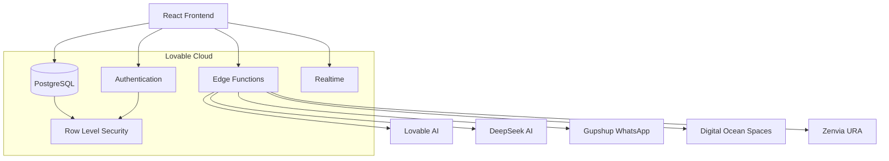

---

## 💾 Banco de Dados

### Tabelas por Módulo

#### 🔐 Autenticação e Permissões (5 tabelas)

| Tabela | Descrição |
|--------|-----------|
| `user_roles` | Roles de usuários (RBAC) |
| `perfis_usuario` | Perfis detalhados dos usuários |
| `perfis` | Templates de perfis |
| `permissoes` | Permissões do sistema |
| `equipes` | Equipes e times |

#### 👥 CRM - Gestão de Clientes (8 tabelas)

| Tabela | Descrição |
|--------|-----------|
| `clientes` | Cadastro de clientes |
| `contas` | Contas corporativas |
| `contatos` | Contatos de clientes/contas |
| `enderecos_clientes` | Endereços de entrega |
| `contatos_clientes` | Relacionamento contato-cliente |
| `perfis_sociais` | Perfis de redes sociais |
| `atividades` | Histórico de atividades |
| `vw_clientes_completo` | View com dados completos |

#### 💰 Vendas e Oportunidades (9 tabelas)

| Tabela | Descrição |
|--------|-----------|
| `vendas` | Vendas realizadas |
| `vendas_itens` | Itens das vendas |
| `oportunidades` | Pipeline de vendas |
| `itens_linha_oportunidade` | Produtos da oportunidade |
| `pipelines` | Pipelines de vendas |
| `estagios_pipeline` | Estágios do pipeline |
| `historico_estagio_oportunidade` | Histórico de mudanças |
| `cotacoes` | Cotações |
| `itens_linha_cotacao` | Itens das cotações |

#### 📦 Produtos (3 tabelas)

| Tabela | Descrição |
|--------|-----------|
| `produtos` | Catálogo de produtos |
| `condicoes_pagamento` | Condições de pagamento |
| `tipos_frete` | Tipos de frete |

#### 💬 WhatsApp (7 tabelas)

| Tabela | Descrição |
|--------|-----------|
| `whatsapp_contas` | Contas WhatsApp Business |
| `whatsapp_contatos` | Contatos do WhatsApp |
| `whatsapp_conversas` | Conversas/atendimentos |
| `whatsapp_mensagens` | Mensagens enviadas/recebidas |
| `whatsapp_templates` | Templates de mensagem |
| `whatsapp_respostas_rapidas` | Respostas rápidas |
| `whatsapp_campanhas` | Campanhas de envio |

#### 🎫 Tickets / SAC (6 tabelas)

| Tabela | Descrição |
|--------|-----------|
| `tickets` | Tickets de suporte |
| `tickets_interacoes` | Interações/comentários |
| `tickets_anexos_chat` | Anexos dos tickets |
| `tickets_pausas` | Pausas de atendimento |
| `filas_atendimento` | Filas de atendimento |
| `chat_assistente_mensagens` | Chat com IA |

#### 📞 URA Telefônica (5 tabelas)

| Tabela | Descrição |
|--------|-----------|
| `uras` | URAs configuradas |
| `ura_opcoes` | Opções de menu |
| `ura_horarios` | Horários de funcionamento |
| `ura_audios` | Biblioteca de áudios |
| `ura_logs` | Logs de chamadas |

#### ⚙️ Configurações (4 tabelas)

| Tabela | Descrição |
|--------|-----------|
| `empresas` | Empresas do sistema |
| `tipos_pedido` | Tipos de pedido |
| `membros_equipe` | Membros das equipes |
| `base_conhecimento` | Artigos de ajuda |

### Funções de Segurança

```sql
-- Verificar se usuário tem uma role específica
has_role(_user_id uuid, _role app_role) → boolean

-- Verificar se usuário tem qualquer uma das roles
has_any_role(_user_id uuid, _roles app_role[]) → boolean

-- Obter roles do usuário
get_user_roles(_user_id uuid) → table(user_id, email, roles, is_admin, ...)

-- Listar todos os usuários com roles (apenas admins)
list_users_with_roles() → table(user_id, email, roles[])
```

### Triggers Principais

| Trigger | Tabela | Função |
|---------|--------|--------|
| `update_updated_at` | Várias | Atualiza timestamp automaticamente |
| `set_numero_ticket` | `tickets` | Gera número sequencial |
| `registrar_mudanca_ticket` | `tickets` | Audita mudanças |
| `atualizar_total_interacoes` | `tickets_interacoes` | Conta interações |
| `atualizar_tempo_pausado` | `tickets_pausas` | Calcula tempo de pausa |
| `sync_cliente_conta` | `clientes` | Sincroniza com contas |
| `atualizar_conversa_ultima_mensagem` | `whatsapp_mensagens` | Atualiza última mensagem |
| `verificar_janela_24h` | `whatsapp_mensagens` | Controla janela WhatsApp |

---

## ⚡ Edge Functions

### 1. `analisar-sentimento-cliente`

**Propósito**: Analisa o sentimento do cliente com base nas últimas mensagens do WhatsApp usando Lovable AI.

**Endpoint**: `/functions/v1/analisar-sentimento-cliente`

**Autenticação**: ✅ Requer JWT (`verify_jwt = true`)

**Modelo IA**: `google/gemini-2.5-flash` (Lovable AI)

#### Fluxo de Execução

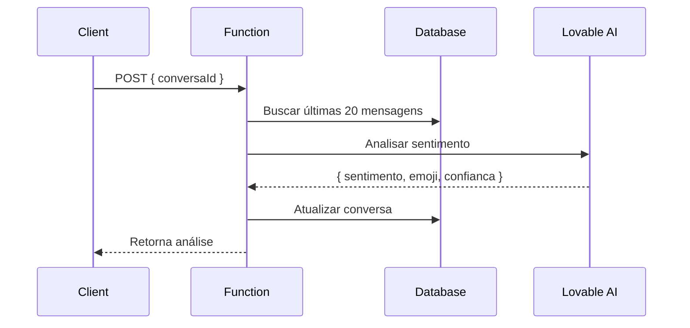

#### Parâmetros

```typescript
// Request
{
  conversaId: string  // UUID da conversa
}

// Response
{
  sentimento: 'positivo' | 'neutro' | 'negativo' | 'frustrado' | 'satisfeito',
  emoji: string,  // Ex: '😊', '😐', '😠'
  confianca: number  // 0-100
}
```

#### Exemplo de Uso

```typescript
import { supabase } from '@/integrations/supabase/client';

const { data, error } = await supabase.functions.invoke('analisar-sentimento-cliente', {
  body: { conversaId: '123e4567-e89b-12d3-a456-426614174000' }
});

console.log(data.sentimento); // 'positivo'
console.log(data.emoji); // '😊'
```

#### Tratamento de Erros

- `429`: Rate limit excedido
- `402`: Créditos de IA esgotados
- `400`: conversaId inválido
- `404`: Conversa não encontrada

---

### 2. `chat-assistente-ticket`

**Propósito**: Assistente IA para ajudar na resolução de tickets de suporte.

**Endpoint**: `/functions/v1/chat-assistente-ticket`

**Autenticação**: ✅ Requer JWT (`verify_jwt = true`)

**Modelo IA**: `deepseek-chat` (DeepSeek AI)

**Streaming**: ✅ Sim (SSE)

#### Fluxo de Execução

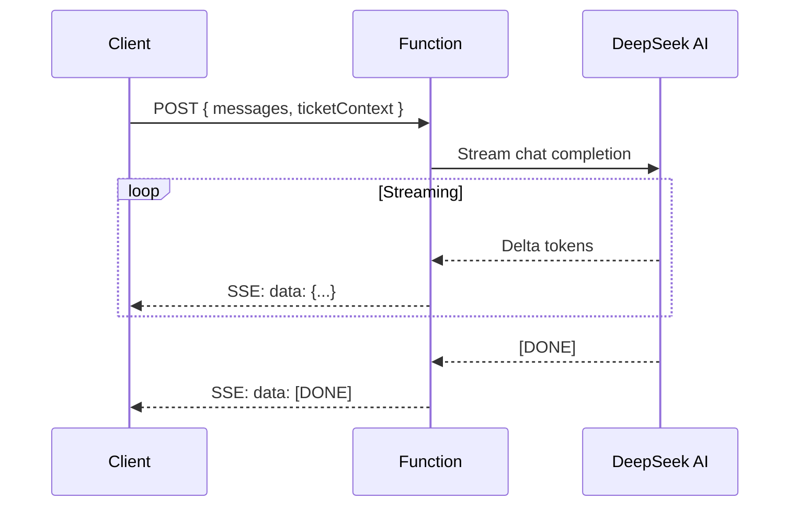

#### Parâmetros

```typescript
// Request
{
  messages: Array<{
    role: 'user' | 'assistant',
    content: string
  }>,
  ticketContext: {
    id: string,
    numero_ticket: string,
    titulo: string,
    descricao: string,
    tipo: string,
    prioridade: string,
    status: string,
    cliente_nome: string
  }
}

// Response: Server-Sent Events (SSE)
// data: {"choices":[{"delta":{"content":"token"}}]}
// data: [DONE]
```

#### Exemplo de Uso

```typescript
const response = await fetch(
  `${import.meta.env.VITE_SUPABASE_URL}/functions/v1/chat-assistente-ticket`,
  {
    method: 'POST',
    headers: {
      'Content-Type': 'application/json',
      'Authorization': `Bearer ${import.meta.env.VITE_SUPABASE_PUBLISHABLE_KEY}`
    },
    body: JSON.stringify({
      messages: [
        { role: 'user', content: 'Como posso resolver este problema?' }
      ],
      ticketContext: ticket
    })
  }
);

const reader = response.body.getReader();
const decoder = new TextDecoder();

while (true) {
  const { done, value } = await reader.read();
  if (done) break;
  
  const chunk = decoder.decode(value);
  const lines = chunk.split('\n');
  
  for (const line of lines) {
    if (line.startsWith('data: ')) {
      const data = line.slice(6);
      if (data === '[DONE]') break;
      
      const parsed = JSON.parse(data);
      const content = parsed.choices[0]?.delta?.content;
      if (content) {
        // Renderizar token imediatamente
        setAssistantMessage(prev => prev + content);
      }
    }
  }
}
```

---

### 3. `chat-assistente-criacao`

**Propósito**: Assistente IA para criar tickets através de conversação guiada.

**Endpoint**: `/functions/v1/chat-assistente-criacao`

**Autenticação**: ✅ Requer JWT (`verify_jwt = true`)

**Modelo IA**: `deepseek-chat` (DeepSeek AI)

#### Fluxo de Execução

O assistente faz perguntas sequenciais para coletar:
1. Descrição do problema
2. Tipo do ticket
3. Prioridade
4. Cliente afetado
5. Produto relacionado (se aplicável)

#### Parâmetros

```typescript
// Request
{
  messages: Array<{ role: string, content: string }>,
  contexto?: {
    cliente_nome?: string,
    produto_nome?: string
  }
}

// Response
{
  mensagem: string,  // Resposta do assistente
  sugestoes?: {
    titulo?: string,
    descricao?: string,
    tipo?: string,
    prioridade?: 'baixa' | 'normal' | 'alta' | 'urgente',
    tags?: string[]
  },
  informacoes_coletadas?: {
    titulo: boolean,
    descricao: boolean,
    tipo: boolean,
    prioridade: boolean,
    cliente: boolean
  }
}
```

#### Exemplo de Uso

```typescript
const { data } = await supabase.functions.invoke('chat-assistente-criacao', {
  body: {
    messages: [
      { role: 'user', content: 'Cliente reportou problema no sistema' }
    ]
  }
});

console.log(data.mensagem); // "Entendo. Qual é especificamente o problema..."
console.log(data.sugestoes); // { tipo: 'reclamacao', prioridade: 'alta' }
```

---

### 4. `classificar-criticidade-ticket`

**Propósito**: Classifica automaticamente a criticidade e fila de atendimento de um ticket.

**Endpoint**: `/functions/v1/classificar-criticidade-ticket`

**Autenticação**: ✅ Requer JWT (`verify_jwt = true`)

**Modelo IA**: `deepseek-chat` (DeepSeek AI)

#### Parâmetros

```typescript
// Request
{
  titulo: string,
  descricao: string,
  tipo: string
}

// Response
{
  prioridade: 'baixa' | 'normal' | 'alta' | 'urgente',
  fila: string,  // Ex: 'Análise Técnica', 'Comercial', 'Financeiro'
  confianca: number  // 0-100
}
```

#### Exemplo de Uso

```typescript
const { data } = await supabase.functions.invoke('classificar-criticidade-ticket', {
  body: {
    titulo: 'Sistema fora do ar',
    descricao: 'Não consigo acessar o sistema há 2 horas',
    tipo: 'reclamacao'
  }
});

console.log(data.prioridade); // 'urgente'
console.log(data.fila); // 'Análise Técnica'
```

---

### 5. `gupshup-enviar-mensagem`

**Propósito**: Envia mensagens WhatsApp através da API Gupshup.

**Endpoint**: `/functions/v1/gupshup-enviar-mensagem`

**Autenticação**: ❌ Público (`verify_jwt = false`)

**Provider**: Gupshup WhatsApp API

#### Fluxo de Execução

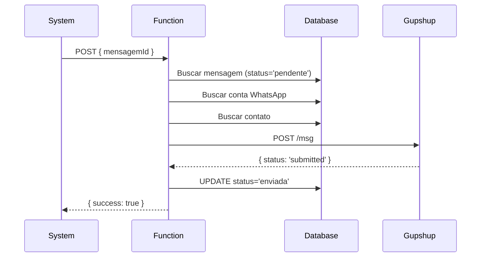

#### Parâmetros

```typescript
// Request
{
  mensagemId: string  // UUID da mensagem
}

// Response
{
  success: boolean,
  messageId?: string,
  error?: string
}
```

#### Formato Gupshup

```typescript
// Payload enviado para Gupshup
{
  channel: 'whatsapp',
  source: '5511999999999',  // Número da conta
  destination: '5511888888888',  // Número do contato
  message: {
    type: 'text',
    text: 'Sua mensagem aqui'
  }
}
```

---

### 6. `gupshup-webhook`

**Propósito**: Recebe webhooks de mensagens do Gupshup e processa no sistema.

**Endpoint**: `/functions/v1/gupshup-webhook`

**Autenticação**: ❌ Público (`verify_jwt = false`)

**Método**: POST

#### Fluxo de Execução

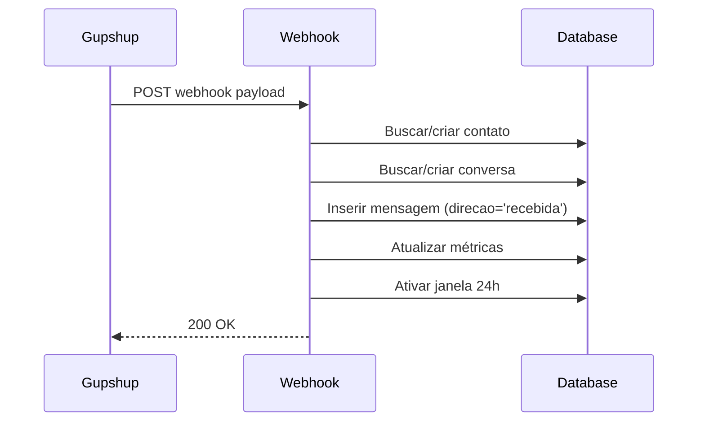

#### Payload Gupshup

```typescript
// Webhook recebido do Gupshup
{
  type: 'message',
  payload: {
    id: 'msg-id-gupshup',
    source: '5511888888888',  // Número do cliente
    payload: {
      type: 'text',
      text: 'Olá, preciso de ajuda'
    },
    sender: {
      phone: '5511888888888',
      name: 'João Silva'
    }
  }
}
```

#### Ações Executadas

1. ✅ Cria/atualiza contato WhatsApp
2. ✅ Cria/atualiza conversa
3. ✅ Insere mensagem recebida
4. ✅ Atualiza métricas de contato
5. ✅ Ativa janela de 24h para resposta
6. ✅ Atualiza timestamp da conversa

---

### 7. `handle-ura-zenvia`

**Propósito**: Gerencia webhooks da URA telefônica Zenvia.

**Endpoint**: `/functions/v1/handle-ura-zenvia`

**Autenticação**: ❌ Público (`verify_jwt = false`)

**Provider**: Zenvia

#### Payload Zenvia

```typescript
{
  callId: string,
  from: string,  // Número que ligou
  to: string,    // Número destino
  event: 'inicio' | 'opcao_selecionada' | 'finalizacao',
  opcao?: number,
  uraId?: string
}
```

---

### 8. `upload-anexo-spaces`

**Propósito**: Upload de arquivos para Digital Ocean Spaces e registro no banco.

**Endpoint**: `/functions/v1/upload-anexo-spaces`

**Autenticação**: ✅ Requer JWT (`verify_jwt = true`)

**Storage**: Digital Ocean Spaces (S3-compatible)

#### Fluxo de Execução

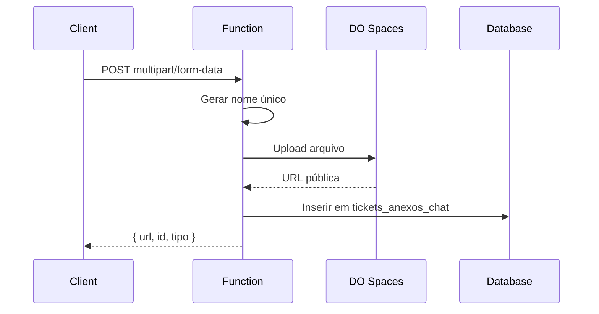

#### Parâmetros

```typescript
// FormData
{
  file: File,
  ticket_id: string
}

// Response
{
  id: string,
  url: string,
  tipo_anexo: 'imagem' | 'video' | 'audio' | 'documento' | 'outro',
  nome_arquivo: string,
  tamanho_bytes: number
}
```

#### Configuração DO Spaces

```typescript
const s3Client = new S3Client({
  endpoint: 'https://nyc3.digitaloceanspaces.com',
  region: 'nyc3',
  credentials: {
    accessKeyId: 'SEU_ACCESS_KEY',
    secretAccessKey: Deno.env.get('DO_SPACES_SECRET_KEY')
  }
});
```

#### Exemplo de Uso

```typescript
const formData = new FormData();
formData.append('file', fileInput.files[0]);
formData.append('ticket_id', ticketId);

const { data } = await supabase.functions.invoke('upload-anexo-spaces', {
  body: formData
});

console.log(data.url); // https://seu-bucket.nyc3.digitaloceanspaces.com/...
```

---

## 🔗 Integrações Externas

### 1. WhatsApp Business via Gupshup

#### Configuração Inicial

1. **Criar conta no Gupshup**: https://www.gupshup.io/
2. **Obter credenciais**:
   - App ID
   - API Key
   - Phone Number ID
3. **Configurar webhook** em Gupshup:
   ```
   https://seu-projeto.supabase.co/functions/v1/gupshup-webhook
   ```

#### Estrutura de Dados

```typescript
// whatsapp_contas
{
  nome_conta: string,
  numero_whatsapp: string,  // Ex: '5511999999999'
  provider: 'gupshup',
  app_id: string,
  api_key: string,  // Criptografada
  phone_number_id: string,
  status: 'ativo' | 'inativo',
  verificada: boolean
}
```

#### Janela de 24 Horas

O WhatsApp permite respostas gratuitas apenas dentro de 24h após mensagem do cliente:

```typescript
// Verificar janela ativa
const agora = new Date();
const conversaAtiva = conversa.janela_24h_ativa && 
                      conversa.janela_fecha_em > agora;

if (!conversaAtiva) {
  // Precisa usar template aprovado
  await enviarTemplate(templateId);
}
```

#### Métricas Rastreadas

- Total de mensagens enviadas/recebidas
- Tempo de primeira resposta
- Taxa de resposta
- Sentimento do cliente
- Conversões (conversa → oportunidade)

---

### 2. Lovable AI (Gemini 2.5)

#### Modelos Disponíveis

| Modelo | Uso Recomendado | Custo |
|--------|----------------|-------|
| `google/gemini-2.5-pro` | Raciocínio complexo, multimodal | Alto |
| `google/gemini-2.5-flash` | **Padrão** - Balance custo/qualidade | Médio |
| `google/gemini-2.5-flash-lite` | Classificação, resumos simples | Baixo |
| `openai/gpt-5` | Máxima precisão | Muito Alto |
| `openai/gpt-5-mini` | Alternativa equilibrada | Alto |
| `openai/gpt-5-nano` | Alta velocidade | Baixo |

#### Configuração

```typescript
const response = await fetch('https://ai.gateway.lovable.dev/v1/chat/completions', {
  method: 'POST',
  headers: {
    'Authorization': `Bearer ${Deno.env.get('LOVABLE_API_KEY')}`,
    'Content-Type': 'application/json'
  },
  body: JSON.stringify({
    model: 'google/gemini-2.5-flash',  // Modelo padrão
    messages: [
      { role: 'system', content: 'Você é um assistente...' },
      { role: 'user', content: 'Pergunta do usuário' }
    ],
    stream: false
  })
});
```

#### Tratamento de Rate Limits

```typescript
if (response.status === 429) {
  return new Response(
    JSON.stringify({ error: 'Rate limit excedido. Tente novamente em alguns instantes.' }),
    { status: 429 }
  );
}

if (response.status === 402) {
  return new Response(
    JSON.stringify({ error: 'Créditos de IA esgotados. Adicione créditos em Settings > Usage.' }),
    { status: 402 }
  );
}
```

#### Casos de Uso no Projeto

1. **Análise de Sentimento**: Identifica emoção do cliente em conversas
2. **Assistente de Tickets**: Sugere soluções para problemas
3. **Criação Guiada**: Coleta informações via chat

---

### 3. DeepSeek AI

#### Configuração

```typescript
const response = await fetch('https://api.deepseek.com/v1/chat/completions', {
  method: 'POST',
  headers: {
    'Authorization': `Bearer ${Deno.env.get('DEEPSEEK_API_KEY')}`,
    'Content-Type': 'application/json'
  },
  body: JSON.stringify({
    model: 'deepseek-chat',
    messages: [...]
  })
});
```

#### Secret Necessária

```bash
# Adicionar via Lovable Cloud UI
DEEPSEEK_API_KEY=sk-...
```

#### Uso no Projeto

- ✅ Classificação de criticidade de tickets
- ✅ Identificação automática de fila
- ✅ Streaming de chat para assistente

---

### 4. Digital Ocean Spaces

#### Configuração

```typescript
// Credenciais necessárias
{
  endpoint: 'https://nyc3.digitaloceanspaces.com',
  region: 'nyc3',
  bucket: 'seu-bucket',
  accessKeyId: 'SEU_ACCESS_KEY',
  secretAccessKey: 'DO_SPACES_SECRET_KEY'  // Secret
}
```

#### Tipos de Arquivo Suportados

```typescript
const MIME_TYPES = {
  'image/jpeg': 'imagem',
  'image/png': 'imagem',
  'image/webp': 'imagem',
  'application/pdf': 'documento',
  'video/mp4': 'video',
  'audio/mpeg': 'audio',
  'audio/wav': 'audio'
};
```

#### URL Pública

```
https://seu-bucket.nyc3.digitaloceanspaces.com/tickets/123/arquivo-unico.pdf
```

---

### 5. Zenvia (URA Telefônica)

#### Webhook Endpoint

```
POST https://seu-projeto.supabase.co/functions/v1/handle-ura-zenvia
```

#### Eventos Processados

- `inicio`: Chamada iniciada
- `opcao_selecionada`: Cliente digitou opção
- `finalizacao`: Chamada encerrada

#### Estrutura de URA

```typescript
{
  uras: {
    nome: string,
    numero_telefone: string,
    mensagem_boas_vindas: string,
    url_audio_boas_vindas?: string
  },
  ura_opcoes: {
    numero_opcao: number,  // 0-9
    tipo_acao: 'transferir' | 'submenu' | 'desligar' | 'voicemail',
    ramal_destino?: string,
    ura_submenu_id?: string
  }
}
```

---

## 🔑 Variáveis de Ambiente

### Variáveis Públicas (.env)

```bash
# Lovable Cloud (auto-gerenciadas)
VITE_SUPABASE_URL=https://rzzzfprgnoywmmjwepzm.supabase.co
VITE_SUPABASE_PUBLISHABLE_KEY=eyJhbGc...
VITE_SUPABASE_PROJECT_ID=rzzzfprgnoywmmjwepzm
```

### Secrets do Supabase

Secrets são variáveis de ambiente criptografadas, disponíveis apenas nas Edge Functions:

| Secret | Uso | Como Obter |
|--------|-----|------------|
| `LOVABLE_API_KEY` | Lovable AI Gateway | Auto-provisionada |
| `DEEPSEEK_API_KEY` | DeepSeek AI | https://platform.deepseek.com |
| `DO_SPACES_SECRET_KEY` | Digital Ocean Spaces | DO Console → API |
| `SUPABASE_SERVICE_ROLE_KEY` | Admin operations | Auto-provisionada |
| `SUPABASE_DB_URL` | Database direct | Auto-provisionada |
| `SUPABASE_URL` | Project URL | Auto-provisionada |

#### Como Adicionar Secret

1. Acesse **Backend** (Lovable Cloud UI)
2. Vá em **Settings** → **Secrets**
3. Clique em **Add Secret**
4. Insira nome e valor
5. Salve

#### Acessar Secret em Edge Function

```typescript
const apiKey = Deno.env.get('DEEPSEEK_API_KEY');

if (!apiKey) {
  throw new Error('DEEPSEEK_API_KEY não configurada');
}
```

---

## 🔐 Autenticação

### Fluxo de Autenticação

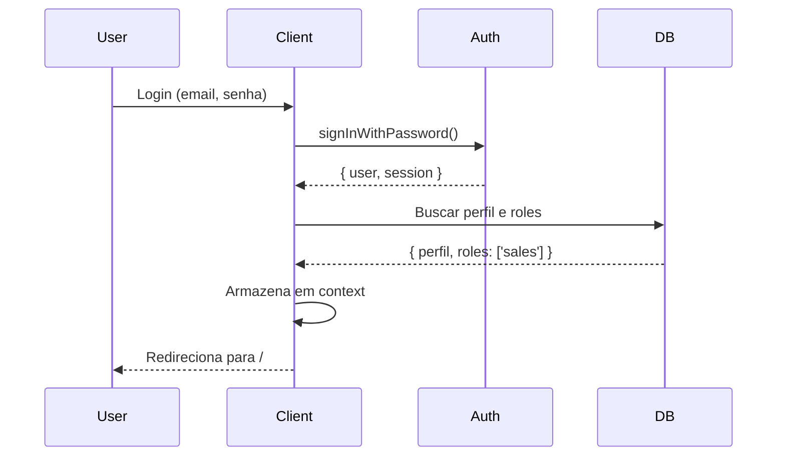

### Implementação

#### 1. Configurar Auto-Confirm

```typescript
// Edge function ou migration
// Emails são auto-confirmados (desenvolvimento)
```

#### 2. Sign Up

```typescript
import { supabase } from '@/integrations/supabase/client';

const { data, error } = await supabase.auth.signUp({
  email: 'usuario@example.com',
  password: 'senha-segura-123',
  options: {
    data: {
      primeiro_nome: 'João',
      sobrenome: 'Silva'
    }
  }
});
```

#### 3. Sign In

```typescript
const { data, error } = await supabase.auth.signInWithPassword({
  email: 'usuario@example.com',
  password: 'senha-segura-123'
});

if (data.user) {
  // Usuário autenticado
  const session = data.session;
}
```

#### 4. Sign Out

```typescript
await supabase.auth.signOut();
```

#### 5. Proteção de Rotas

```tsx
// src/components/ProtectedRoute.tsx
import { Navigate } from 'react-router-dom';
import { useAuth } from '@/hooks/useAuth';

export const ProtectedRoute = ({ children }) => {
  const { user, isLoading } = useAuth();
  
  if (isLoading) return <div>Carregando...</div>;
  if (!user) return <Navigate to="/auth" />;
  
  return children;
};

// src/App.tsx
<Route path="/dashboard" element={
  <ProtectedRoute>
    <Dashboard />
  </ProtectedRoute>
} />
```

### Sessão Persistente

```typescript
// Configurado automaticamente em src/integrations/supabase/client.ts
export const supabase = createClient(SUPABASE_URL, SUPABASE_KEY, {
  auth: {
    storage: localStorage,
    persistSession: true,
    autoRefreshToken: true
  }
});
```

---

## 👥 Sistema de Permissões (RBAC)

### Roles Disponíveis

```sql
-- Enum de roles
CREATE TYPE app_role AS ENUM (
  'admin',      -- Administrador total
  'manager',    -- Gerente
  'sales',      -- Vendedor
  'warehouse',  -- Almoxarife
  'support'     -- Suporte
);
```

### Estrutura de Dados

```typescript
// user_roles table
{
  id: uuid,
  user_id: uuid,  // FK para auth.users
  role: app_role
}

// Único constraint: user_id + role
```

### Funções de Verificação

#### 1. `has_role(user_id, role)`

```sql
-- Verifica se usuário tem role específica
SELECT has_role(auth.uid(), 'admin');  -- true/false
```

#### 2. `has_any_role(user_id, roles[])`

```sql
-- Verifica se usuário tem qualquer uma das roles
SELECT has_any_role(
  auth.uid(), 
  ARRAY['admin'::app_role, 'manager'::app_role]
);
```

#### 3. `get_user_roles(user_id)`

```sql
-- Retorna todas as informações de roles
SELECT * FROM get_user_roles(auth.uid());

-- Resultado:
{
  user_id: uuid,
  email: string,
  roles: app_role[],
  is_admin: boolean,
  is_manager: boolean,
  is_sales: boolean,
  is_warehouse: boolean,
  is_support: boolean
}
```

#### 4. `list_users_with_roles()` (Admin only)

```sql
-- Lista todos usuários e suas roles
SELECT * FROM list_users_with_roles();
```

### Uso no Frontend

```typescript
import { useRoles } from '@/hooks/useRoles';

const Component = () => {
  const { isAdmin, isSales, hasRole } = useRoles();
  
  if (isAdmin) {
    return <AdminPanel />;
  }
  
  if (hasRole('sales')) {
    return <SalesPanel />;
  }
  
  return <AccessDenied />;
};
```

### Adicionar/Remover Roles

```typescript
const { addRole, removeRole } = useRoles();

// Adicionar role
await addRole.mutateAsync({
  userId: '123...',
  role: 'sales'
});

// Remover role
await removeRole.mutateAsync({
  userId: '123...',
  role: 'sales'
});
```

### RLS Policies com Roles

```sql
-- Exemplo: Apenas admins e managers podem deletar tickets
CREATE POLICY "Admins podem deletar tickets"
ON tickets
FOR DELETE
TO authenticated
USING (
  has_any_role(auth.uid(), ARRAY['admin'::app_role, 'manager'::app_role])
);
```

---

## 🌐 APIs e Endpoints

### Chamando Edge Functions

#### Método 1: supabase.functions.invoke() (Recomendado)

```typescript
import { supabase } from '@/integrations/supabase/client';

const { data, error } = await supabase.functions.invoke('nome-funcao', {
  body: { param1: 'valor' }
});

if (error) {
  console.error('Erro:', error);
  return;
}

console.log('Resultado:', data);
```

#### Método 2: Fetch direto

```typescript
const response = await fetch(
  `${import.meta.env.VITE_SUPABASE_URL}/functions/v1/nome-funcao`,
  {
    method: 'POST',
    headers: {
      'Content-Type': 'application/json',
      'Authorization': `Bearer ${import.meta.env.VITE_SUPABASE_PUBLISHABLE_KEY}`
    },
    body: JSON.stringify({ param1: 'valor' })
  }
);

const data = await response.json();
```

### Tratamento de Erros Padrão

```typescript
const { data, error } = await supabase.functions.invoke('funcao', {
  body: payload
});

if (error) {
  // Tratar diferentes tipos de erro
  if (error.message.includes('429')) {
    toast.error('Muitas requisições. Aguarde um momento.');
  } else if (error.message.includes('402')) {
    toast.error('Créditos de IA esgotados. Contate o administrador.');
  } else {
    toast.error('Erro ao processar requisição.');
  }
  return;
}

// Sucesso
toast.success('Operação concluída!');
```

### Rate Limits

Lovable AI possui rate limits por workspace:

- **Plano Free**: 100 requests/minuto
- **Plano Paid**: 1000 requests/minuto

Para aumentar, contactar support@lovable.dev

### Exemplos Completos

#### Enviar Mensagem WhatsApp

```typescript
// 1. Criar mensagem no DB
const { data: mensagem } = await supabase
  .from('whatsapp_mensagens')
  .insert({
    conversa_id: conversaId,
    whatsapp_contato_id: contatoId,
    direcao: 'enviada',
    tipo_mensagem: 'texto',
    conteudo_texto: 'Olá, tudo bem?',
    status: 'pendente'
  })
  .select()
  .single();

// 2. Chamar edge function para enviar
const { data, error } = await supabase.functions.invoke('gupshup-enviar-mensagem', {
  body: { mensagemId: mensagem.id }
});

if (error) {
  toast.error('Erro ao enviar mensagem WhatsApp');
}
```

#### Analisar Sentimento

```typescript
const { data } = await supabase.functions.invoke('analisar-sentimento-cliente', {
  body: { conversaId: '123...' }
});

// Atualizar UI com sentimento
setSentimento(data.sentimento);  // 'positivo', 'negativo', ...
setEmoji(data.emoji);  // '😊', '😐', '😠'
```

#### Upload de Arquivo

```typescript
const formData = new FormData();
formData.append('file', fileInput.files[0]);
formData.append('ticket_id', ticketId);

const { data } = await supabase.functions.invoke('upload-anexo-spaces', {
  body: formData
});

// URL pública do arquivo
console.log(data.url);
```

---

## ⚡ Realtime

### Habilitar Realtime em Tabela

```sql
-- Habilitar publicação realtime
ALTER PUBLICATION supabase_realtime ADD TABLE public.whatsapp_mensagens;
ALTER PUBLICATION supabase_realtime ADD TABLE public.tickets;
ALTER PUBLICATION supabase_realtime ADD TABLE public.tickets_interacoes;
```

### Subscribir a Mudanças

```typescript
import { supabase } from '@/integrations/supabase/client';
import { useEffect } from 'react';

const WhatsAppChat = () => {
  useEffect(() => {
    // Escutar novas mensagens
    const channel = supabase
      .channel('mensagens-realtime')
      .on(
        'postgres_changes',
        {
          event: 'INSERT',
          schema: 'public',
          table: 'whatsapp_mensagens',
          filter: `conversa_id=eq.${conversaId}`
        },
        (payload) => {
          console.log('Nova mensagem:', payload.new);
          setMensagens(prev => [...prev, payload.new]);
        }
      )
      .subscribe();

    return () => {
      supabase.removeChannel(channel);
    };
  }, [conversaId]);

  return <div>...</div>;
};
```

### Eventos Disponíveis

- `INSERT`: Novo registro criado
- `UPDATE`: Registro atualizado
- `DELETE`: Registro deletado
- `*`: Qualquer mudança

### Exemplos de Uso no Projeto

#### 1. Chat WhatsApp em Tempo Real

```typescript
supabase
  .channel('chat')
  .on('postgres_changes', {
    event: 'INSERT',
    schema: 'public',
    table: 'whatsapp_mensagens'
  }, (payload) => {
    // Adicionar mensagem ao chat
    addMessage(payload.new);
  })
  .subscribe();
```

#### 2. Atualização de Status de Ticket

```typescript
supabase
  .channel('ticket-status')
  .on('postgres_changes', {
    event: 'UPDATE',
    schema: 'public',
    table: 'tickets',
    filter: `id=eq.${ticketId}`
  }, (payload) => {
    // Atualizar status na UI
    setTicket(payload.new);
  })
  .subscribe();
```

#### 3. Notificações de Novos Tickets

```typescript
supabase
  .channel('new-tickets')
  .on('postgres_changes', {
    event: 'INSERT',
    schema: 'public',
    table: 'tickets'
  }, (payload) => {
    // Mostrar notificação
    toast.info(`Novo ticket: ${payload.new.numero_ticket}`);
  })
  .subscribe();
```

---

## 🔒 Segurança

### Row-Level Security (RLS)

Todas as tabelas possuem RLS habilitado:

```sql
ALTER TABLE public.tickets ENABLE ROW LEVEL SECURITY;
```

### Políticas RLS Comuns

#### 1. Usuário Vê Apenas Seus Dados

```sql
CREATE POLICY "Users can view their own clientes"
ON clientes
FOR SELECT
TO authenticated
USING (auth.uid() = user_id);
```

#### 2. Apenas Admins Podem Deletar

```sql
CREATE POLICY "Admins podem deletar tickets"
ON tickets
FOR DELETE
TO authenticated
USING (has_role(auth.uid(), 'admin'));
```

#### 3. Verificação de Múltiplas Roles

```sql
CREATE POLICY "Sales podem criar oportunidades"
ON oportunidades
FOR INSERT
TO authenticated
WITH CHECK (
  has_any_role(auth.uid(), ARRAY['admin', 'manager', 'sales'])
);
```

#### 4. Verificação de Ownership

```sql
CREATE POLICY "Proprietários podem atualizar oportunidades"
ON oportunidades
FOR UPDATE
TO authenticated
USING (
  proprietario_id = auth.uid() OR
  has_any_role(auth.uid(), ARRAY['admin', 'manager'])
);
```

### Validações e Constraints

#### Triggers de Validação

```sql
-- Gerar número de ticket automaticamente
CREATE TRIGGER set_numero_ticket
BEFORE INSERT ON tickets
FOR EACH ROW
EXECUTE FUNCTION set_numero_ticket();

-- Registrar mudanças de status
CREATE TRIGGER registrar_mudanca_ticket
AFTER UPDATE ON tickets
FOR EACH ROW
EXECUTE FUNCTION registrar_mudanca_ticket();
```

#### Check Constraints

```sql
-- Validar prioridade
ALTER TABLE tickets
ADD CONSTRAINT valid_prioridade
CHECK (prioridade IN ('baixa', 'normal', 'alta', 'urgente'));

-- Validar avaliação
ALTER TABLE tickets
ADD CONSTRAINT valid_avaliacao
CHECK (avaliacao >= 1 AND avaliacao <= 5);
```

### Boas Práticas de Segurança

1. ✅ **Nunca** expor `SUPABASE_SERVICE_ROLE_KEY` no frontend
2. ✅ **Sempre** usar RLS em tabelas com dados de usuários
3. ✅ **Validar** entrada de dados em Edge Functions
4. ✅ **Usar** `SECURITY DEFINER` com cuidado
5. ✅ **Limitar** escopo de policies (mais restritivas possível)
6. ✅ **Auditar** ações críticas (triggers de log)
7. ✅ **Criptografar** secrets e API keys

### Funções com SECURITY DEFINER

```sql
-- Função roda com privilégios do owner (bypass RLS)
CREATE OR REPLACE FUNCTION has_role(_user_id uuid, _role app_role)
RETURNS boolean
LANGUAGE sql
STABLE
SECURITY DEFINER  -- ⚠️ Cuidado!
SET search_path = public
AS $$
  SELECT EXISTS (
    SELECT 1 FROM public.user_roles
    WHERE user_id = _user_id AND role = _role
  )
$$;
```

**⚠️ Cuidado**: `SECURITY DEFINER` bypassa RLS. Use apenas quando necessário.

---

## 🚀 Deployment

### Edge Functions

Edge Functions são **automaticamente deployadas** quando você faz alterações:

1. ✅ Edite arquivo em `supabase/functions/nome-funcao/index.ts`
2. ✅ Aguarde rebuild do projeto
3. ✅ Função é deployada automaticamente

### Configuração (config.toml)

```toml
project_id = "rzzzfprgnoywmmjwepzm"

# Função com autenticação
[functions.chat-assistente-ticket]
verify_jwt = true

# Função pública (webhook)
[functions.gupshup-webhook]
verify_jwt = false
```

### Verificar Status de Funções

Acesse: **Backend** → **Edge Functions**

Você verá:
- ✅ Status (deployed/failed)
- 📊 Logs recentes
- ⚙️ Configuração (verify_jwt)
- 🔗 Endpoint URL

### Rollback de Deployment

Se uma função falhar:

1. Reverta o código no editor
2. Aguarde rebuild
3. Nova versão será deployada

**Não há versionamento automático** - mantenha backups do código!

### Monitoramento

#### Edge Function Logs

```typescript
// Ver logs via Lovable Cloud UI
// Backend → Edge Functions → Nome da Função → Logs

// Logs são automáticos via console.log/error
console.log('Mensagem enviada:', messageId);
console.error('Erro ao enviar:', error);
```

#### Database Logs

```sql
-- Ver logs do PostgreSQL
-- Backend → Logs → Database
```

### Variáveis de Ambiente

Para atualizar secrets:

1. **Backend** → **Settings** → **Secrets**
2. Edite o secret
3. Salve
4. **Redeploy** a função (faça edit + save)

---

## 🔧 Troubleshooting

### Erros Comuns

#### 1. "LOVABLE_API_KEY not configured"

**Causa**: Secret não configurada

**Solução**:
```bash
# Verificar em Backend → Settings → Secrets
# Se não existir, é auto-provisionada
```

#### 2. "Rate limit exceeded" (429)

**Causa**: Muitas requisições à Lovable AI

**Solução**:
```typescript
// Implementar debounce
const debouncedAnalyze = debounce(async () => {
  await supabase.functions.invoke('analisar-sentimento-cliente', ...);
}, 1000);

// Ou adicionar retry
async function withRetry(fn, maxRetries = 3) {
  for (let i = 0; i < maxRetries; i++) {
    try {
      return await fn();
    } catch (error) {
      if (error.status === 429 && i < maxRetries - 1) {
        await new Promise(resolve => setTimeout(resolve, 2000 * (i + 1)));
      } else {
        throw error;
      }
    }
  }
}
```

#### 3. "Permission denied" ao acessar tabela

**Causa**: RLS policy não permite acesso

**Solução**:
```sql
-- Verificar policies
SELECT * FROM pg_policies WHERE tablename = 'nome_tabela';

-- Verificar roles do usuário
SELECT * FROM get_user_roles(auth.uid());
```

#### 4. Edge Function timeout

**Causa**: Função demora > 60s

**Solução**:
```typescript
// Otimizar query
const { data } = await supabase
  .from('tabela')
  .select('apenas, campos, necessarios')  // Não use '*'
  .limit(100);  // Limitar resultados

// Ou dividir em múltiplas chamadas menores
```

#### 5. "No rows returned" em insert/update

**Causa**: RLS bloqueou operação

**Solução**:
```typescript
// Verificar WITH CHECK e USING da policy
// Logar erro detalhado
console.error('Insert failed:', error);
```

### Debugging de Edge Functions

#### Logs Locais (development)

```typescript
// Adicionar logs detalhados
console.log('[DEBUG] Request body:', JSON.stringify(req));
console.log('[DEBUG] User ID:', auth.uid());
console.log('[DEBUG] Query result:', data);
```

#### Logs de Produção

1. **Backend** → **Edge Functions** → **Nome da Função**
2. Aba **Logs**
3. Filtrar por erro/warning

#### Testar Localmente

```bash
# Não é possível rodar Supabase localmente em Lovable
# Use logs detalhados na produção
```

### Performance

#### Query Lenta

```sql
-- Adicionar índice
CREATE INDEX idx_tickets_status ON tickets(status);
CREATE INDEX idx_mensagens_conversa ON whatsapp_mensagens(conversa_id);

-- Verificar explain plan
EXPLAIN ANALYZE SELECT * FROM tickets WHERE status = 'aberto';
```

#### Edge Function Lenta

```typescript
// Paralelizar queries
const [tickets, clientes, produtos] = await Promise.all([
  supabase.from('tickets').select(),
  supabase.from('clientes').select(),
  supabase.from('produtos').select()
]);

// Em vez de:
const tickets = await supabase.from('tickets').select();
const clientes = await supabase.from('clientes').select();
const produtos = await supabase.from('produtos').select();
```

### Suporte

Para problemas não resolvidos:

1. 📧 **Email**: support@lovable.dev
2. 💬 **Chat**: Lovable Cloud UI
3. 📚 **Docs**: https://docs.lovable.dev

---

## 📊 Diagramas Técnicos

### Fluxo de Mensagens WhatsApp

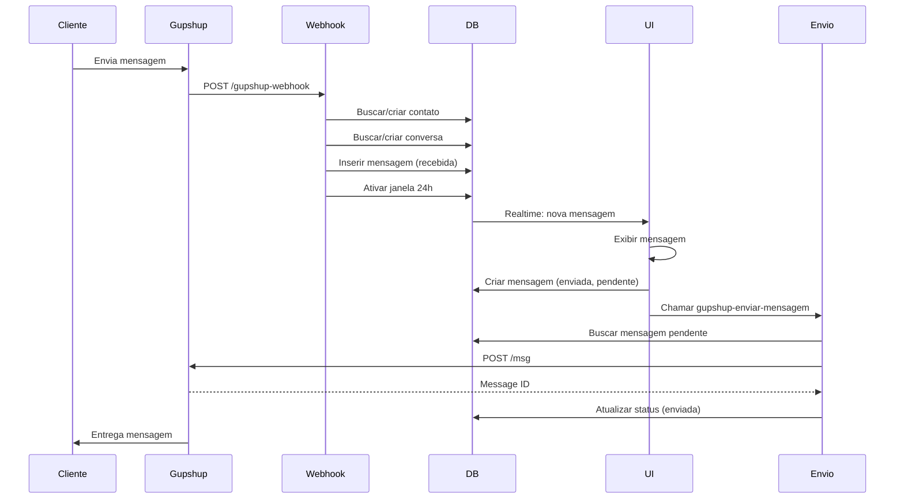

### Fluxo de Criação de Ticket com IA

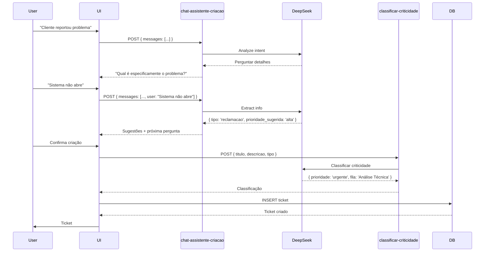

### Arquitetura de Autenticação

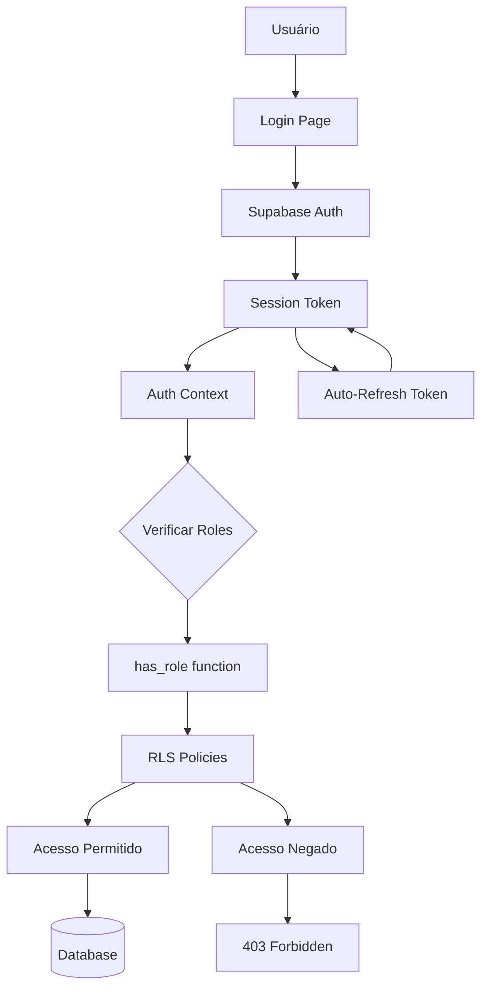

### Relacionamentos do Banco (Principais)

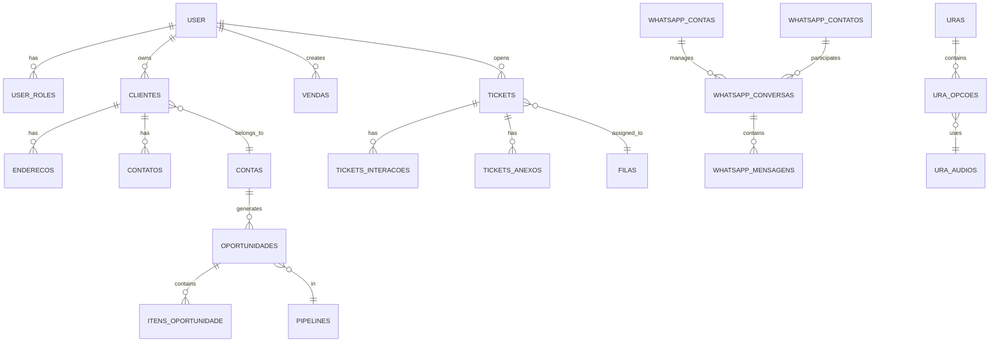

---

## 📝 Checklist de Configuração

Para configurar o projeto do zero:

### 1. Lovable Cloud

- [x] Projeto conectado ao Lovable Cloud
- [x] Database criado
- [x] Edge Functions deployadas

### 2. Secrets

- [x] `LOVABLE_API_KEY` (auto)
- [x] `DEEPSEEK_API_KEY` (manual)
- [x] `DO_SPACES_SECRET_KEY` (manual)
- [x] `SUPABASE_SERVICE_ROLE_KEY` (auto)

### 3. Integrações Externas

- [ ] Gupshup WhatsApp
  - [ ] Criar conta
  - [ ] Configurar webhook
  - [ ] Adicionar App ID e API Key
- [ ] Digital Ocean Spaces
  - [ ] Criar bucket
  - [ ] Configurar CORS
  - [ ] Adicionar Access Key/Secret
- [ ] DeepSeek AI
  - [ ] Criar conta
  - [ ] Gerar API key
  - [ ] Adicionar secret
- [ ] Zenvia (opcional)
  - [ ] Contratar serviço
  - [ ] Configurar webhook

### 4. Database

- [x] Rodar migrations iniciais
- [x] Habilitar RLS em todas as tabelas
- [ ] Criar usuário admin inicial
- [ ] Adicionar roles ao usuário

### 5. Autenticação

- [x] Auto-confirm email habilitado
- [ ] Criar primeiro usuário
- [ ] Atribuir role 'admin'

### 6. Frontend

- [x] Variáveis de ambiente configuradas
- [x] Supabase client inicializado
- [x] Protected routes implementadas

---

## 🎯 Próximos Passos Recomendados

1. **Implementar testes automatizados** para Edge Functions
2. **Adicionar monitoramento** (Sentry, LogRocket)
3. **Criar dashboard de analytics** com métricas de uso
4. **Implementar cache** para queries frequentes
5. **Adicionar CI/CD** para deploy automatizado
6. **Documentar** APIs públicas com Swagger/OpenAPI
7. **Criar guia de contribuição** para novos desenvolvedores

---

**Última atualização**: 2025-01-23  
**Versão**: 1.0.0  
**Mantido por**: Equipe de Desenvolvimento

Para dúvidas ou sugestões, abra uma issue ou contate support@lovable.dev 🚀
