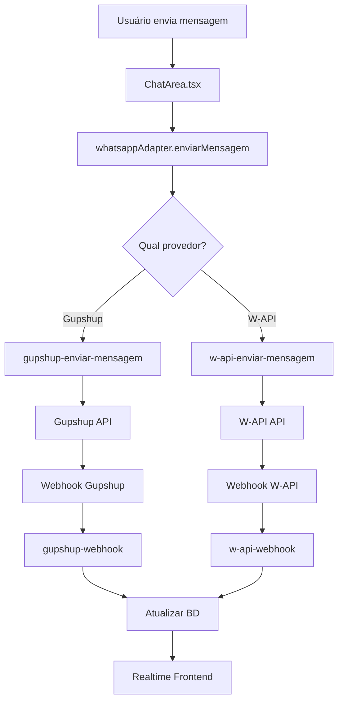

# WhatsApp Multi-API

## Arquitetura

O sistema suporta dois modos de operação:
- **API Oficial**: Gupshup (provedor homologado)
- **API Não Oficial**: W-API (provedor alternativo)

## Fluxo de Mensagens

## Configuração

### Gupshup (API Oficial)
1. Criar conta no Gupshup
2. Obter `app_id_gupshup`, `api_key_gupshup` e `phone_number_id_gupshup`
3. Cadastrar conta em WhatsApp > Configurações > Contas
4. Configurar webhook: `https://SEU_PROJETO.supabase.co/functions/v1/gupshup-webhook`

### W-API (API Não Oficial)
1. Criar instância no W-API
2. Obter `instance_id` e `token`
3. Cadastrar conta em WhatsApp > Configurações > Contas
4. Configurar webhook: `https://SEU_PROJETO.supabase.co/functions/v1/w-api-webhook`
5. Aplicar webhook para todos os eventos (receber, status, conexão)

## Mudança de Provedor

1. Acesse **Configurações > WhatsApp > Config Global**
2. Selecione o provedor desejado
3. Salve (página recarregará automaticamente)
4. Verifique que mensagens estão sendo roteadas corretamente

## Troubleshooting

### Mensagens não estão sendo enviadas
- Verificar configuração global ativa
- Verificar credenciais da conta
- Verificar logs das edge functions

### Webhooks não estão chegando
- Verificar URL configurada no provedor
- Verificar logs de webhook no banco
- Testar com webhook.site

## Estrutura das Tabelas

### whatsapp_configuracao_global
- Define qual provedor está ativo no sistema
- Apenas 1 config pode estar ativa por vez

### whatsapp_contas
- Armazena credenciais de ambos os provedores
- Campo `provedor` identifica qual API usar
- Colunas específicas para cada provedor

### whatsapp_webhooks_log
- Registra todos os webhooks recebidos
- Campo `provedor` identifica origem
